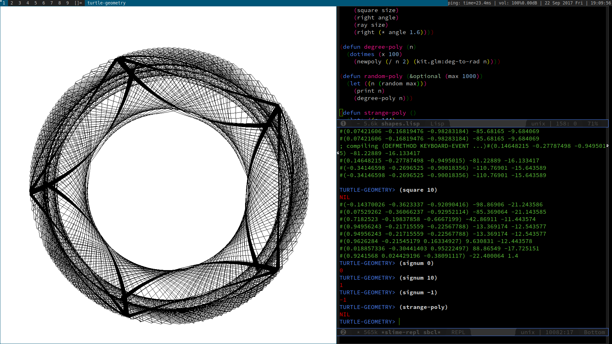

## Turtle Geometry



[Logo](https://en.wikipedia.org/wiki/Logo_(programming_language))
functionality in Common Lisp. Inspired by the
book
[Turtle Geometry](https://mitpress.mit.edu/books/turtle-geometry).

Tested with [SBCL](http://www.sbcl.org).

### Install

Get [quicklisp](https://www.quicklisp.org).

```
cd quicklisp/local-projects/

git clone https://github.com/hahahahaman/turtle-geometry.git
```

In the REPL use quicklisp to install all dependencies and to build
the package:

```common-lisp

(ql:quickload :turtle-geometry)

```
### Usage

In order to save on typing, I run the commands while I'm inside the
turtle-geometry package

REPL:

```common-lisp
(in-package :turtle-geometry)

(run)

(dotimes (x 100) (square x))
```

#### Commands

```common-lisp

;; movement and rotation
(forward distance)
(fd d)

(back distance)
(bk d)

(left radians)
(lt r)

(right radians)
(rt r)

(roll radians) # x-axis rotation
(pitch radians) # y
(yaw radians) # z

;; pen
(pen-down)
(pen-up)
(pen-toggle)
(color)

;; misc.
(clear)
(clr)

```

#### Interface

The interface is a hybrid graphical text interface. A graphical
windows is created with SDL2, which acts as a first person explorer
of the 3D space. Using Emacs and Slime the Logo commands are
inputted.

`shapes.lisp` stores code from the book.

Hotkeys in `main.lisp`:

```

`ESC` - quit

`LALT+r` - clear

`LCTRL+MOUSE Move` - change camera direction

`LCTRL+{w,a,s,d}` - move up, down, left, right

`LCTRL+MOUSE_WHEEL` - zoom in and out

`LSHIFT+TAB` - get camera to face the turtle

`z` - decrease camera speed

`x` - increase camera speed

`c` - print camera info to console

```

#### Ideas

In *Mindstorms*, Papert presents the idea of microworlds, which
resonate me as a compelling way to interact with mathematical
behavior. I am particularly interest in the connection between
building a idealized thought experiment in the mind vs. the machine.
Thought experiments
([Gedankenexperiment](https://en.wikipedia.org/wiki/Thought_experiment))
are typically used in physics in order to reason about nature. The
idea of microworlds is similar, in that it tries to distill and
elaborate upon a important feature of a system, but the act of
creation used to build a microworld seems to give resonating nuance.

##### Turtle

[turtle.lisp](src/turtle.lisp)

The turtle is an immutable map of attributes, which includes:
position, color, rotation, and pen up/down.

#### License

[MIT](LICENSE)
